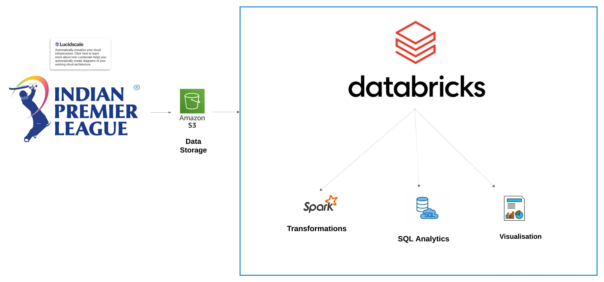

# IPL Data Analysis | Apache Spark End-to-End Data Engineering Project
IPL Data Analysis | Apache Spark End-to-End Data Engineering Project

## Introduction
This project focuses on analyzing IPL (Indian Premier League) cricket data using PySpark within a Databricks environment. Leveraging AWS S3 for data storage, we aim to perform in-depth analysis and derive actionable insights from match statistics, player performance, and team dynamics. Our approach utilizes Spark SQL and PySpark to handle large datasets efficiently and generate meaningful reports.

## Architecture

## Technology Used
1. Apache Spark: A powerful, open-source unified analytics engine for large-scale data processing. Utilized for big data processing and analysis through PySpark and Spark   SQL.
2. Databricks: An integrated workspace for big data analytics and machine learning that simplifies using Spark, with collaborative notebooks for developing and running      PySpark code.
3. AWS S3: A scalable object storage service used for storing and managing IPL data, providing reliable and secure access to datasets.

**Dataset Used:** https://data.world/raghu543/ipl-data-till-2017

## Script for the project
1. 
